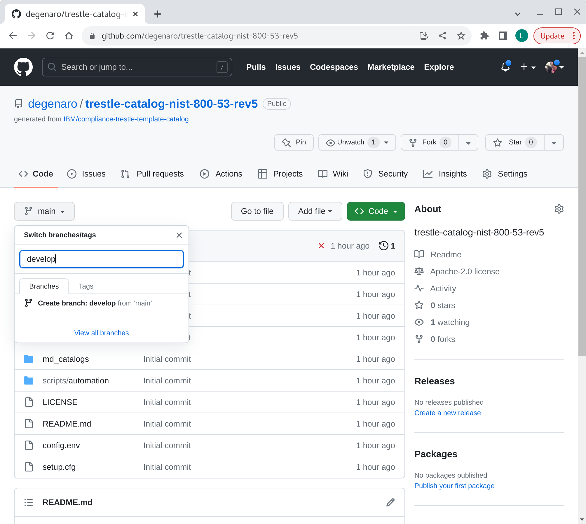
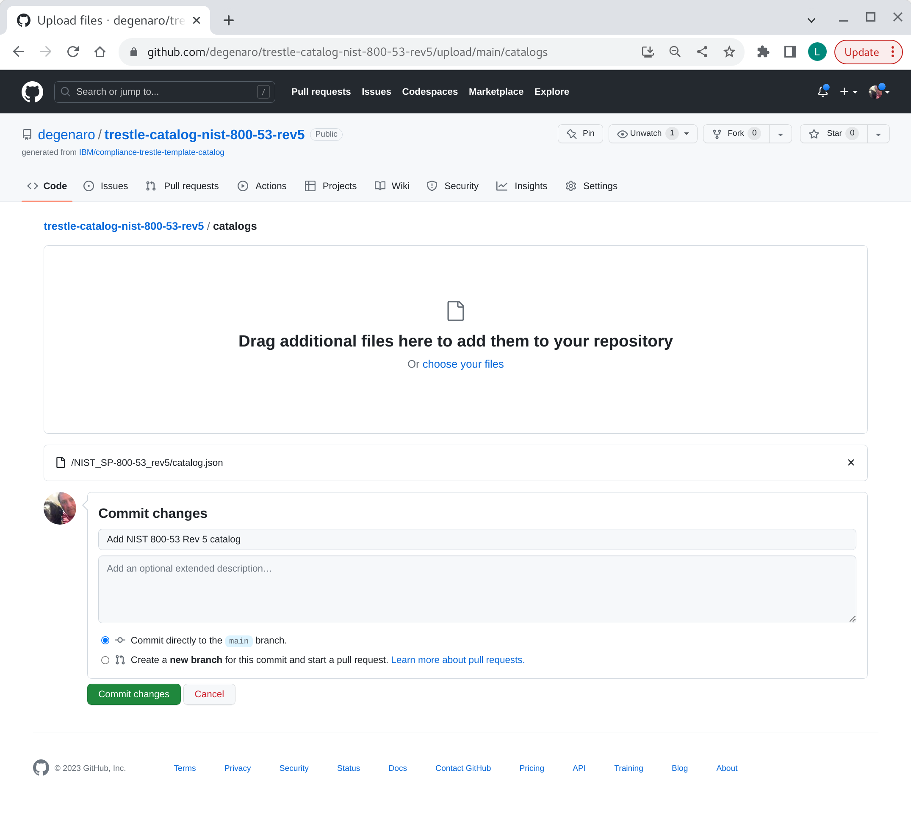

## catalog repo setup

Create your `catalog` repo from the agile authoring template.

Follow the instructions for [creating-a-repository-from-a-template](https://docs.github.com/en/repositories/creating-and-managing-repositories/creating-a-repository-from-a-template) to create a new repository from template.
Use the [compliance-trestle-template-catalog](https://github.com/IBM/compliance-trestle-template-catalog) as your template.

*-> Use this template -> Create a new repository*

Choose a repo name and description, for example:
- Repository name `trestle-catalog-nist-800-53-rev5`
- Description `trestle-catalog-nist-800-53-rev5`

*-> Create repository from template*

###### Customize the catalog repo settings

Install token (from prereqs above) in your newly created `trestle-catalog-nist-800-53-rev5` repo.
Navigate to the newly created `trestle-catalog-nist-800-53-rev5` repo, then use path:

*Settings -> Secrets and variables -> Actions -> New repository secret*

Add repository secret name GIT_TOKEN, and specify your token value.
See [prerequisites](README.md#Prerequisites) for token requirements.

*-> New repository secret*

*-> Add secret*

<details>
<summary>token add to repo</summary>

</details>


###### create develop branch

Add branch "develop".

*-> Code*

*-> main -> find or create branch:* develop

*-> create branch: develop from 'main'* 

<details>
<summary>add develop branch</summary>

</details>

###### customize the automation scripts

Navigate to the newly created `trestle-catalog-nist-800-53-rev5` repo, then edit:

*-> select file:* config.env

*-> edit (pencil on right)*
Update the variables:

- GROUP: is the `family` part of the URL (e.g. `degenaro` of https://github.com/`degenaro`/trestle-catalog-nist-800-53-rev5)
- CATALOG: is the folder name containing the catalog in the catalogs folder (e.g. `NIST_SP-800-53_rev5` of catalogs/`NIST_SP-800-53_rev5`/catalog.json)
- PROFILE is the folder name containing the profile
- EMAIL is the e-mail address to receive notifications

Example:

- GROUP=degenaro 
- CATALOG=NIST_SP-800-53_rev5 
- PROFILE=NIST_SP-800-53_rev5 
- EMAIL=lou.degenaro@gmail.com 

*-> Commit changes*

<details>
<summary>update config.env</summary>

</details>

###### install the initial OSCAL catalog (in json format)

- Download the NIST 800-53 Rev 5 catalog to your workstation (laptop)

```
$ mkdir -p download/NIST_SP-800-53_rev5
$ cd download/NIST_SP-800-53_rev5
$ wget https://raw.githubusercontent.com/usnistgov/oscal-content/main/nist.gov/SP800-53/rev5/json/NIST_SP-800-53_rev5_catalog.json
$ mv NIST_SP-800-53_rev5_catalog.json catalog.json
```

- Put the NIST 800-53 Rev 5 catalog into your repo by dragging folder `NIST_SP-800-53_rev5/catalog.json` to the repo in the browser.

In browser:

Navigate to catalogs folder.

*-> Add file -> Upload files*

Drag `NIST_SP-800-53_rev5/catalog.json` to catalogs folder.

**Note**: Be sure the folder is included and that the folder name matches the `CATALOG=` name specified in the `config.env`.

*-> Commit changes*

<details>
<summary>add catalog</summary>

</details>
