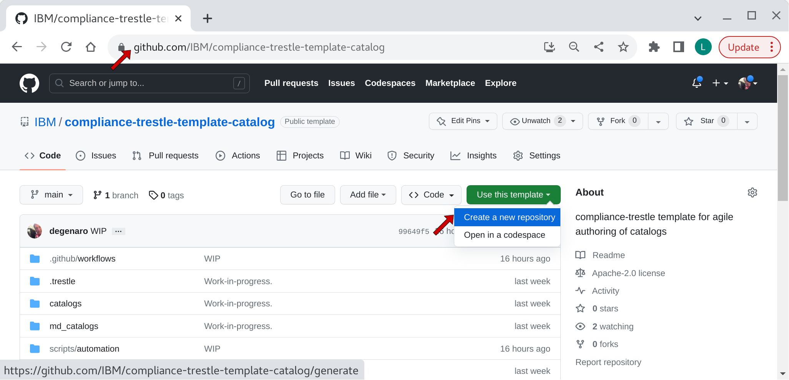
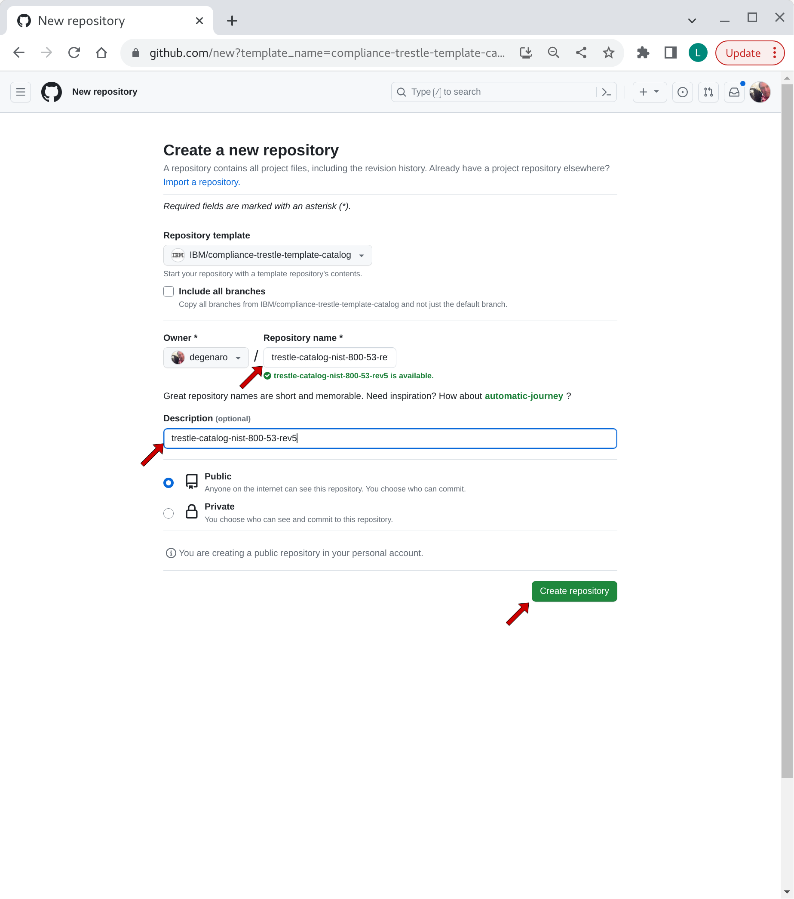
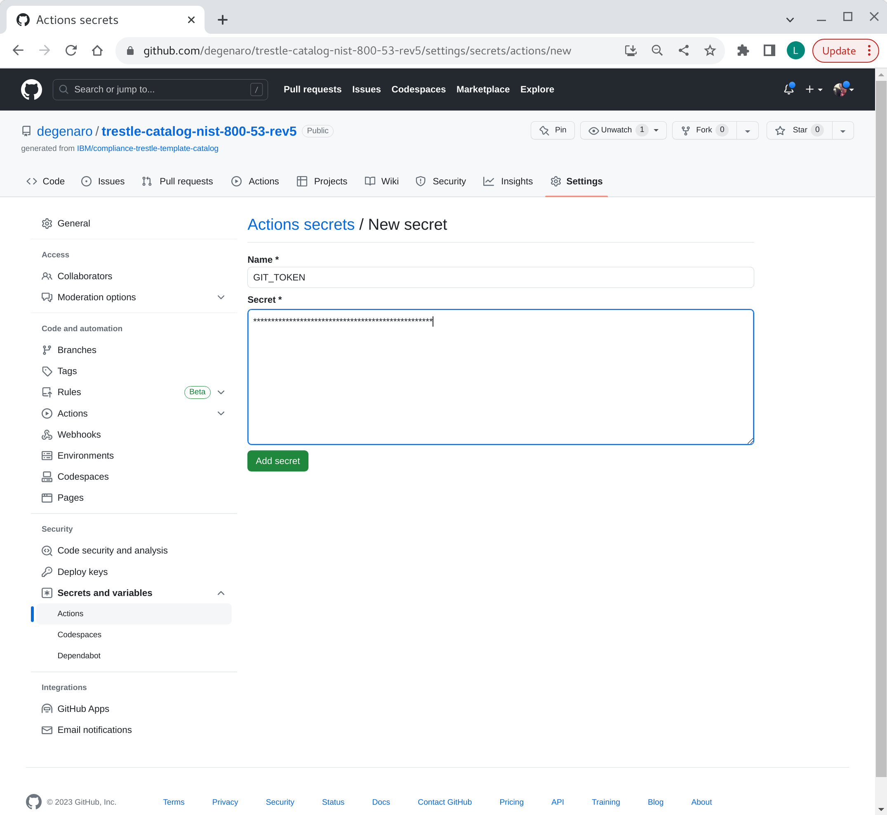
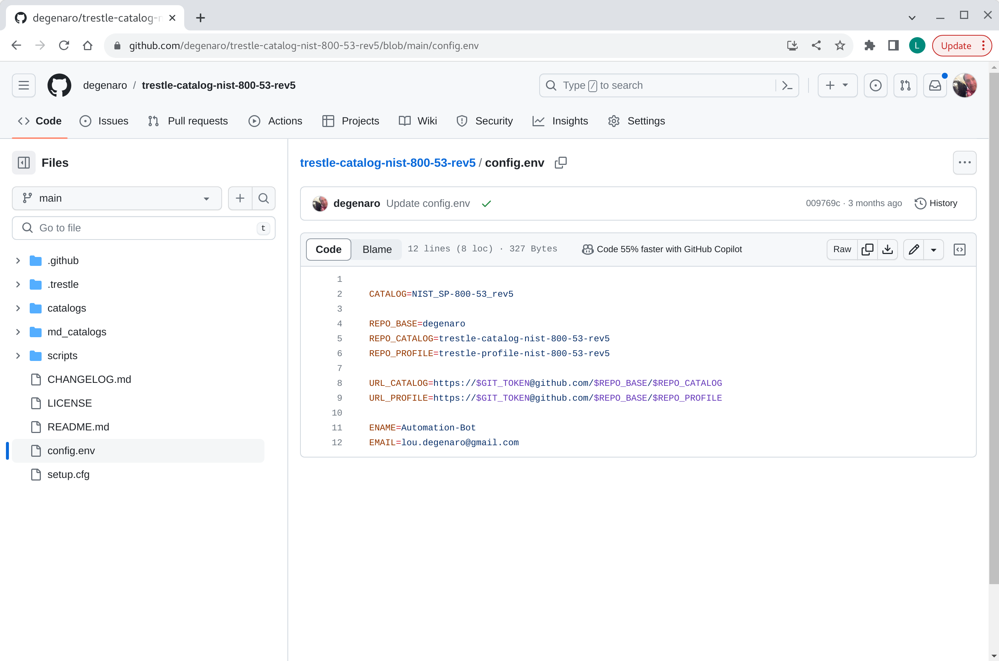
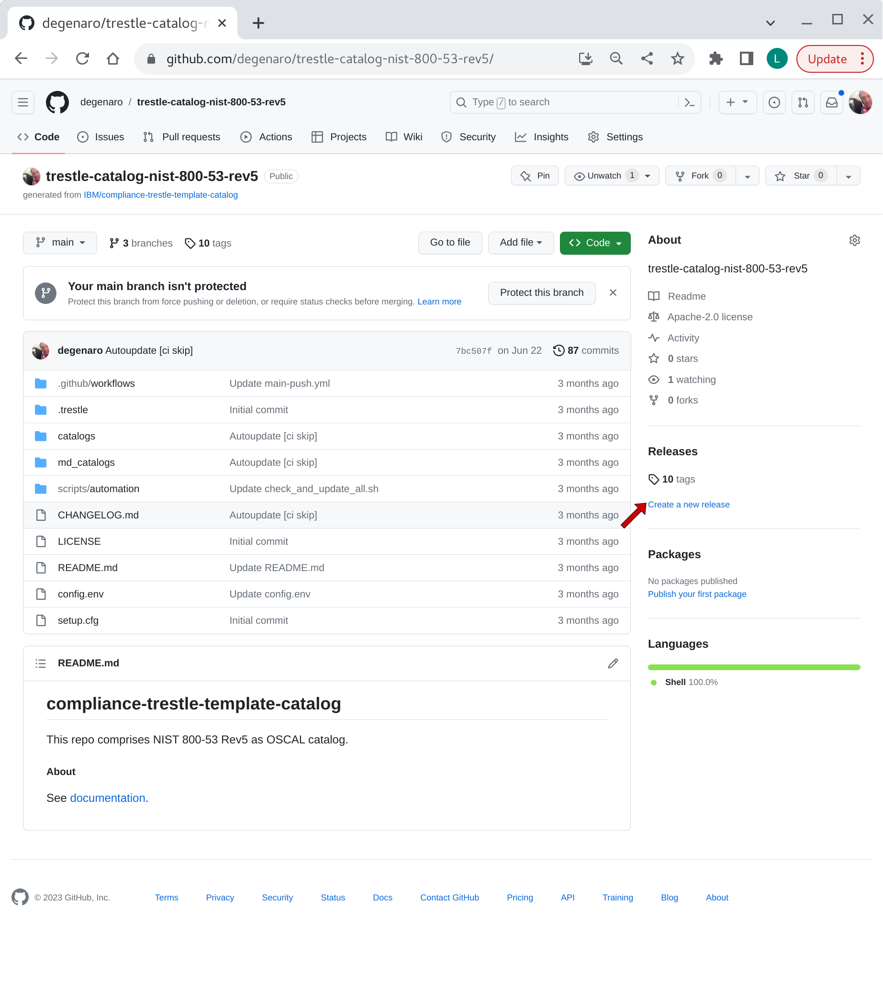
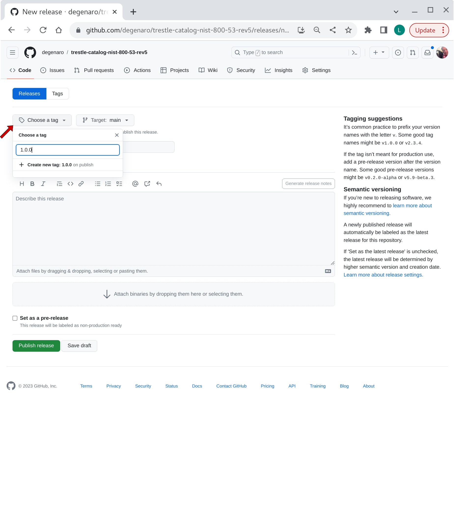
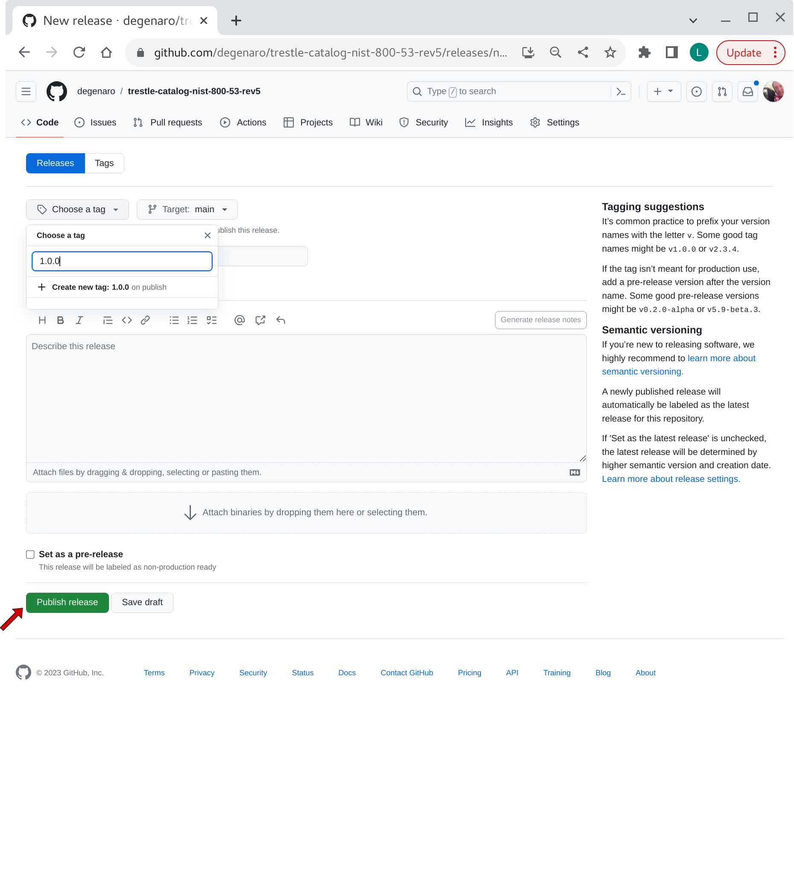

## catalog repo create

Instructions for setting up trestle agile authoring GIT repository for OSCAL `catalog` document.

###### 0. prerequisites

- create GitHub [token](README.md#prerequisites)
- follow steps 1 & 2 for creating downstream [profile](README.create-repo-profile.md) repository.

###### 1. catalog repo creation

Create your `catalog` repo from the agile authoring template.

Follow the instructions for [creating-a-repository-from-a-template](https://docs.github.com/en/repositories/creating-and-managing-repositories/creating-a-repository-from-a-template) to create a new repository from template.
Use the [compliance-trestle-template-catalog](https://github.com/IBM/compliance-trestle-template-catalog) as your template.

*-> Use this template -> Create a new repository*

Choose a repo name and description, for example:
- Repository name `trestle-catalog-nist-800-53-rev5`
- Description `trestle-catalog-nist-800-53-rev5`

*-> Create repository from template*

<details>
<summary>visual</summary>

</details>

*-> Create a new repository*

<details>
<summary>visual</summary>

</details>

-----

###### 2. create catalog develop branch

Add branch "develop".

*-> Code*

*-> main -> find or create branch:* develop

*-> create branch: develop from 'main'* 

<details>
<summary>visual</summary>

</details>

-----

###### 3. customize the catalog repo settings

Install token (from prereqs above) in your newly created `trestle-catalog-nist-800-53-rev5` repo.
Navigate to the newly created `trestle-catalog-nist-800-53-rev5` repo, then use path:

*Settings -> Secrets and variables -> Actions -> New repository secret*

Add repository secret name GIT_TOKEN, and specify your token value.
See [prerequisites](README.md#Prerequisites) for token requirements.

*-> New repository secret*

*-> Add secret*

<details>
<summary>visual</summary>

</details>

-----

###### 4. customize the catalog automation scripts (develop branch)

Navigate to the newly created `trestle-catalog-nist-800-53-rev5` repo, then edit:

*-> select file:* config.env

*-> edit (pencil on right)*
Update the variables:

- CATALOG: is the folder name containing the catalog in the catalogs folder (e.g. `NIST_SP-800-53_rev5` of catalogs/`NIST_SP-800-53_rev5`/catalog.json)

- REPO_BASE: is the `base` part of the URL (e.g. `degenaro` of https://github.com/`degenaro`/trestle-catalog-nist-800-53-rev5)

- REPO_CATALOG is the part of the URL for the catalog under the base (e.g. `trestle-catalog-nist-800-53-rev5` of https://github.com/degenaro/`trestle-catalog-nist-800-53-rev5`)
- REPO_PROFILE is the part of the URL for the profile under the base (e.g. `trestle-profile-nist-800-53-rev5` of https://github.com/degenaro/`trestle-profile-nist-800-53-rev5`)

- NAME is the name of the committer
- EMAIL is the e-mail address to receive notifications

Example:

- CATALOG=*NIST_SP-800-53_rev5*

- REPO_BASE=*degenaro*

- REPO_CATALOG=*trestle-catalog-nist-800-53-rev5*
- REPO_PROFILE=*trestle-profile-nist-800-53-rev5*

- NAME=*Automation-Bot*
- EMAIL=*compliance.trestle@gmail.com*

*-> Commit changes*

<details>
<summary>visual</summary>

</details>

-----

###### 5. customize the catalog automation yml (develop branch)

*-> select file:* .github/workflows/main-push.yml
*-> edit (pencil on right)*
Locate these lines:

- repository: my-repo-base/my-profile
- path: './my-profile'

change to:

- repository: degenaro/trestle-profile-nist-800-53-rev5
- path: './trestle-profile-nist-800-53-rev5'

*-> Commit changes*

-----

###### 6. install the initial OSCAL catalog in json format (develop branch)

- Download the NIST 800-53 Rev 5 catalog to your workstation (laptop)

```
$ mkdir -p download/NIST_SP-800-53_rev5
$ cd download/NIST_SP-800-53_rev5
$ wget https://raw.githubusercontent.com/usnistgov/oscal-content/main/nist.gov/SP800-53/rev5/json/NIST_SP-800-53_rev5_catalog.json
$ mv NIST_SP-800-53_rev5_catalog.json catalog.json
```

- Put the NIST 800-53 Rev 5 catalog into your repo by dragging folder `NIST_SP-800-53_rev5/catalog.json` to the repo in the browser.

In browser:

Navigate to catalogs folder.

*-> Add file -> Upload files*

Drag `NIST_SP-800-53_rev5/catalog.json` to catalogs folder.

**Note**: Be sure the folder is included and that the folder name matches the `CATALOG=` name specified in the `config.env`.

*-> Commit changes*

<details>
<summary>visual</summary>

</details>

###### 7. push changes from develop branch to main branch

*-> Compare & pull request*

**Note**: For semantic versioning, set to title to `feat: initial catalog`

*-> Create pull request*

*-> Merge pull request*

*-> Confirm merge*


###### 8. create release in main branch, then push changes from main branch to develop branch

*-> Create a new release*

<details>
<summary>visual</summary>

</details>

*-> Choose a tag*

<details>
<summary>visual</summary>

</details>

*-> Publish release*

<details>
<summary>visual</summary>

</details>
