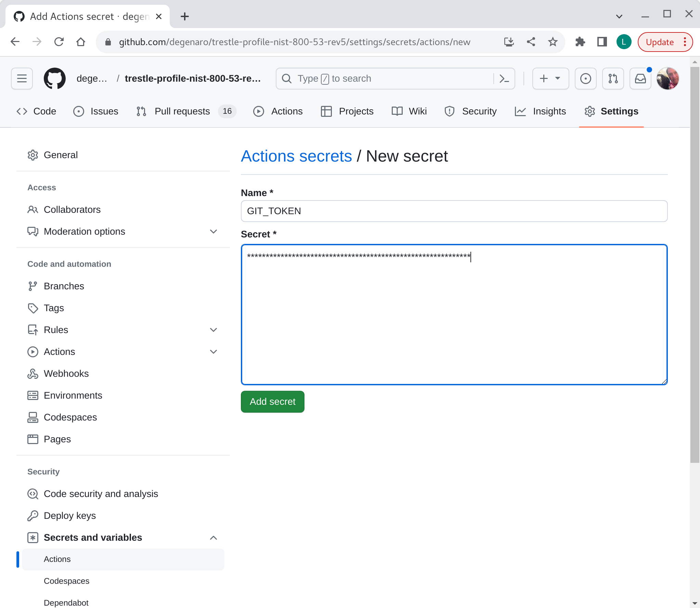
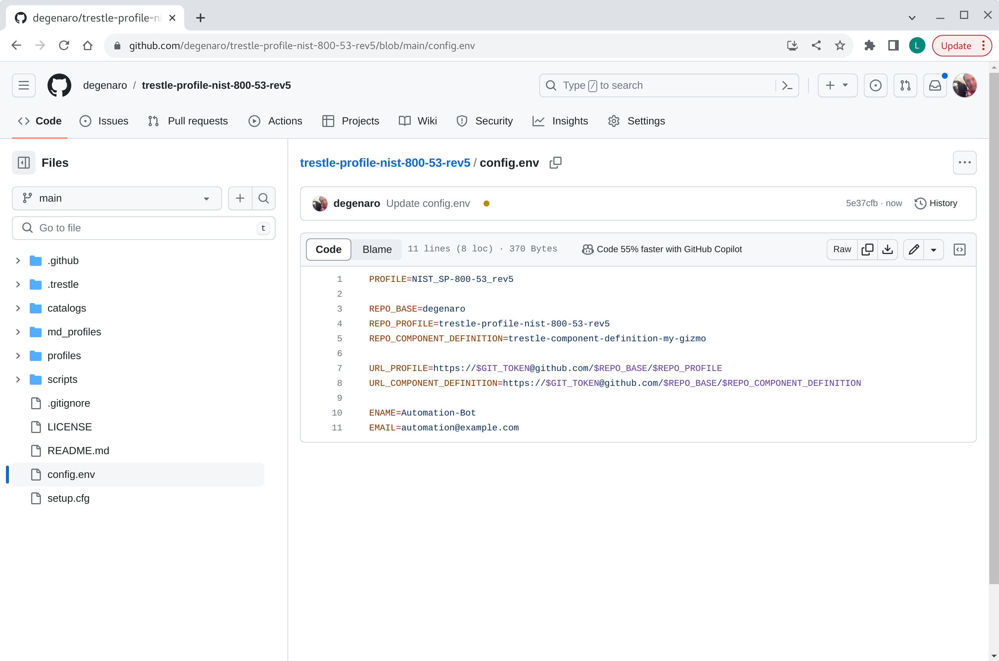

## profile repo create

Instructions for setting up trestle agile authoring GIT repository for OSCAL `profile` document.

###### 0. prerequisites

- create GitHub [token](README.md#prerequisites)

###### 1. profile repo creation

Create your `profile` repo from the agile authoring template.

Follow the instructions for [creating-a-repository-from-a-template](https://docs.github.com/en/repositories/creating-and-managing-repositories/creating-a-repository-from-a-template) to create a new repository from template.
Use the [compliance-trestle-template-profile](https://github.com/IBM/compliance-trestle-template-profile) as your template.

*-> Use this template -> Create a new repository*

Choose a repo name and description, for example:
- Repository name `trestle-profile-nist-800-53-rev5`
- Description `trestle-profile-nist-800-53-rev5`

*-> Create repository from template*

visual

-----

###### 2. create profile develop branch

Add branch "develop".

*-> Code*

*-> main -> find or create branch:* develop

*-> create branch: develop from 'main'* 

visual

-----

###### 3. customize the profile repo settings

Install token (from prereqs above) in your newly created `trestle-profile-nist-800-53-rev5` repo.
Navigate to the newly created `trestle-profile-nist-800-53-rev5` repo, then use path:

*Settings -> Secrets and variables -> Actions -> New repository secret*

Add repository secret name GIT_TOKEN, and specify your token value.
See [prerequisites](README.md#Prerequisites) for token requirements.

*-> New repository secret*

*-> Add secret*

visual

-----

###### 4. customize the profile automation scripts (develop branch)

Navigate to the newly created `trestle-profile-nist-800-53-rev5` repo, then edit:

*-> select file:* config.env

*-> edit (pencil on right)*
Update the variables:

- PROFILE: is the folder name containing the profile in the profiles folder (e.g. `NIST_SP-800-53_rev5` of profiles/`NIST_SP-800-53_rev5`/profile.json)

- REPO_BASE: is the `base` part of the URL (e.g. `degenaro` of https://github.com/`degenaro`/trestle-profile-nist-800-53-rev5)

- REPO_PROFILE is the part of the URL for the profile under the base (e.g. `trestle-profile-nist-800-53-rev5` of https://github.com/degenaro/`trestle-profile-nist-800-53-rev5`)
- REPO_COMPONENT_DEFINITION is the part of the URL for the component-definition under the base (e.g. `trestle-component-definition-my-gizmo` of https://github.com/degenaro/`trestle-component-definition-my-gizmo`)

- ENAME is the name of the committer
- EMAIL is the e-mail address to receive notifications

Example:

- PROFILE=*NIST_SP-800-53_rev5*

- REPO_BASE=*degenaro*

- REPO_PROFILE=*trestle-profile-nist-800-53-rev5*
- REPO_COMPONENT_DEFINITION=*trestle-component-definition-my-gizmo*

- URL_PROFILE=https://$GIT_TOKEN@github.com/$REPO_BASE/$REPO_PROFILE
- URL_COMPONENT_DEFINITION=https://$GIT_TOKEN@github.com/$REPO_BASE/$REPO_COMPONENT_DEFINITION

- ENAME=*Automation-Bot*
- EMAIL=*lou.degenaro@gmail.com*

*-> Commit changes*

visual

-----

###### 5. customize the profile automation yml (develop branch)

*-> select file:* .github/workflows/main-push.yml
*-> edit (pencil on right)*
Locate these lines:

- repository: my-repo-base/my-profile
- path: './my-profile'

change to:

- repository: degenaro/trestle-component-definition-my-gizmo
- path: './trestle-component-definition-my-gizmo'

*-> Commit changes*

