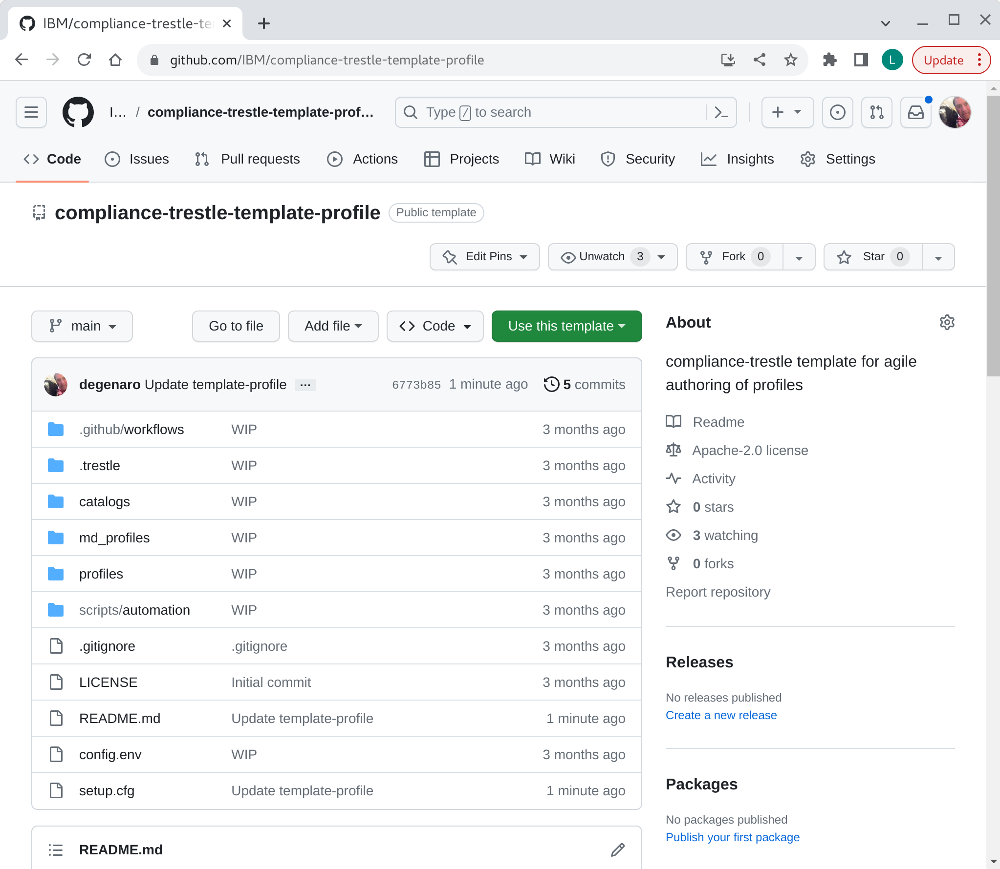
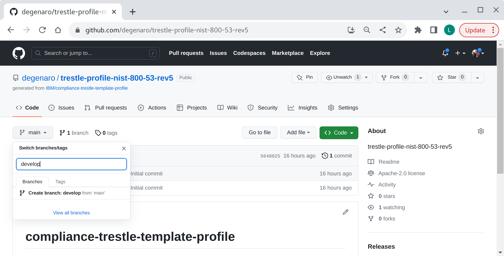

## profile repo create

Instructions for setting up trestle agile authoring GIT repository for OSCAL `profile` document.

###### 1. profile repo creation

Create your `profile` repo from the agile authoring template.

Follow the instructions for [creating-a-repository-from-a-template](https://docs.github.com/en/repositories/creating-and-managing-repositories/creating-a-repository-from-a-template) to create a new repository from template.
Use the [compliance-trestle-template-profile](https://github.com/IBM/compliance-trestle-template-profile) as your template.

*-> Use this template -> Create a new repository*

Choose a repo name and description, for example:
- Repository name `trestle-profile-nist-800-53-rev5`
- Description `trestle-profile-nist-800-53-rev5`

*-> Create repository from template*

visual

-----

###### 2. create profile develop branch

Add branch "develop".

*-> Code*

*-> main -> find or create branch:* develop

*-> create branch: develop from 'main'* 

visual

-----