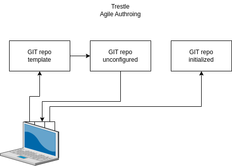
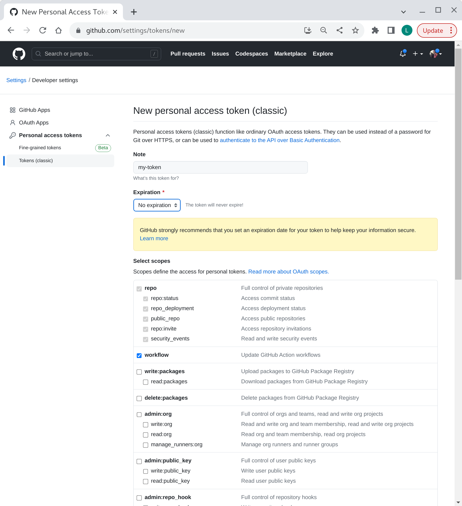
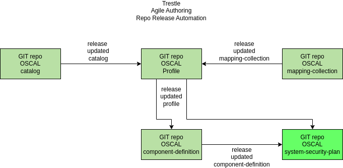

## compliance-trestle-agile-authoring

This repo is comprises documentation and tutorials for OSCAL-oriented agile authoring pipelines.
To establish foundational knowledge about OSCAL and the agile authoring paradigm, see the references at the bottom of this page.

##### 1. overview: agile authoring for compliance-trestle

Compliance-[trestle](https://github.com/IBM/compliance-trestle)
supports agile authoring of 
[OSCAL](https://pages.nist.gov/OSCAL/) 
artifacts such as 
[catalogs](https://pages.nist.gov/OSCAL-Reference/models/latest/catalog/json-outline/), 
[profiles](https://pages.nist.gov/OSCAL-Reference/models/latest/profile/json-outline/),
[component definitions](https://pages.nist.gov/OSCAL-Reference/models/latest/component-definition/json-outline/),
and
[mapping collections](https://pages.nist.gov/OSCAL/reference/develop/mapping/json-outline/)
which can be managed in a GIT repo with all the associated built-in desirable features including release management, semantic versioning, access control etc.

Beneficially, markdown snippets are automatically supported which facilitates management of large OSCAL documents in more manageable pieces that are understandable by compliance-oriented personnel.
Distribution of modified artifacts to dependent repos is configurable.

##### 2. GIT repo templates

A collection of agile authoring templates are provided, each pre-populated with the scripts and
configurations needed to support agile authoring.

Create repo(s) to support the artifact(s) you desire by instantiating each from the template type desired and performing some minimal customization.

Tutorials and templates are provided to set up agile authoring for each of the following: catalog, profile, component-definition and mapping-collection.

###### template links

- [catalog](https://github.com/IBM/compliance-trestle-template-catalog)
- [profile](https://github.com/IBM/compliance-trestle-template-profile)
- component-definition
- mapping-collection

##### 3. GIT repo - one time setup

Described below is how to create agile authoring repos from templates.
A template repo is use to create a ready-to-configure repo which is then customized.

##### prerequisites

- A GitHub token with `workflow` checked has been created

Create or use existing [token](https://github.com/settings/tokens). Be sure that `workflow` is enabled.

visual

##### GIT repo creation

- [create repo for catalog](README.create-repo-catalog.md)
- [create repo for profile](README.create-repo-profile.md)
- [create repo for component-definition](README.create-repo-component-definition.md)
- [create repo for mapping-collection](README.create-repo-mapping-collection.md)

##### 4. GIT repo - documents lifecycle

The collection of GitHub repos are related to each other as shown above.

The catalog repo contains a catalog, e.g. NIST 800-53 moderate. 
Changes to the the catalog go thru the GIT approval and release process.
The resulting OSCAL catalog is  automatically pushed to corresponding profile repo as a pull request.

The profile repo contains a profile, e.g. a selection of controls from the NIST 800-53 moderate catalog. Several kids of changes kind of changes are possible:
- an updated catalog
- an updated mapping-collection
- added or deleted controls
Changes to the the profile go thru the GIT approval and release process.
The resulting OSCAL profile is automatically pushed to corresponding component-definition repo as a pull request.

The mapping-collection repo contains a mapping-collection, e.g. a mapping of controls from one standard e.g. SOC2 to another standard e.g. NIST 800-53 moderate.
Changes to the the mapping-collection go thru the GIT approval and release process.
The resulting OSCAL mapping-collection is  automatically pushed to corresponding profile repo as a pull request.

The component-definition repo contains a component-definition, e.g. a mapping of controls from one standard e.g. NIST 800-53 moderate to a set of rules
and/checks.
Changes to the the component-definition go thru the GIT approval and release process.
The resulting OSCAL component-definition is  automatically pushed to corresponding system-security-plan repo as a pull request.

##### 5. references

- [Compliance Automated Standard Solution (COMPASS), Part 1: Personas and Roles](https://dzone.com/articles/compass-compliance-part-1)
- [Compliance Automated Standard Solution (COMPASS), Part 2: Trestle SDK](https://dzone.com/articles/compliance-automated-standard-solution-compass-part-2-trestle-sdk)
- [Compliance Automated Standard Solution (COMPASS), Part 3: Artifacts and Personas](https://dzone.com/articles/compliance-automated-standard-solution-compass-part-3-artifacts-and-personas)
- [Compliance Automated Standard Solution (COMPASS), Part 4: Topologies of Compliance Policy Administration Centers](https://dzone.com/articles/compliance-automated-standard-solution-compass-part4-topologies-compliance-policy-administration-centers)

- [Trestle: Compliance-as-Code Orchestrator and Automation Workflows](https://csrc.nist.gov/csrc/media/Presentations/2022/oscal-mini-workshop-2-ibm-s-trestle/IBM_Trestle.pdf)

- [NIST OSCAL](https://pages.nist.gov/OSCAL/)