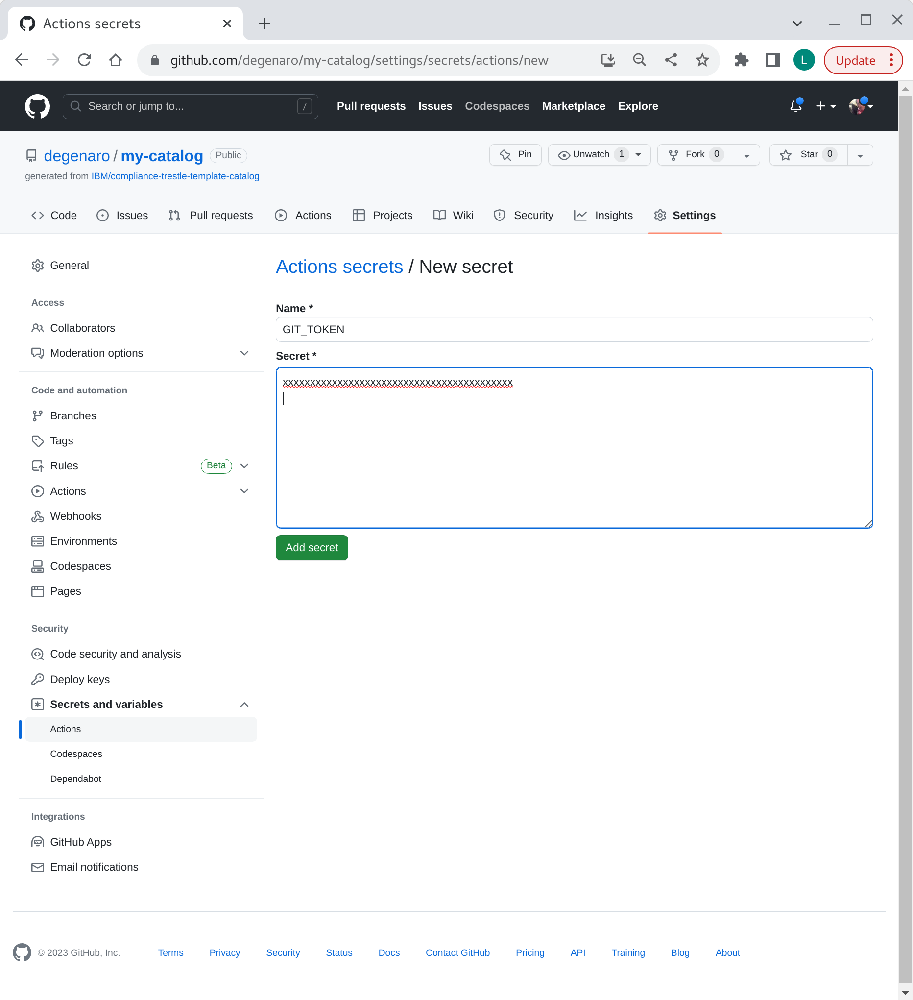

## compliance-trestle-agile-authoring

Note: This repo is currently a `Work-In-Progress`...

##### 1. Overview: agile authoring for compliance-trestle

Compliance-[trestle](https://github.com/IBM/compliance-trestle)
supports agile authoring of 
[OSCAL](https://pages.nist.gov/OSCAL/) 
artifacts such as 
[catalogs](https://pages.nist.gov/OSCAL/reference/latest/catalog/json-outline/), 
[profiles](https://pages.nist.gov/OSCAL/reference/latest/profile/json-outline/),
[component definitions](https://pages.nist.gov/OSCAL/reference/latest/component-definition/json-outline/),
and
[mapping collections](https://pages.nist.gov/OSCAL/reference/develop/mapping/json-outline/)
which can be managed in a GIT repo with all the associated built-in desirable features including release management, semantic versioning, access control etc.

Beneficially, markdown snippets are automatically supported which facilitates management of large OSCAL documents in more manageable pieces that are understandable by compliance-oriented personnel.
Distribution of modified artifacts to dependent repos is configurable.

##### 2. GIT repo templates

A collection of agile authoring templates are provided, each pre-populated with the scripts and
configurations needed to support agile authoring.

You can create repo(s) to support the artifact(s) you desire by instantiating each from the template type desired and performing some minimal customization.

Tutorials and templates are provided to set up agile authoring for each of the following: catalog, profile, component-definition and mapping-collection.

###### Template links

- [catalog](https://github.com/IBM/compliance-trestle-template-catalog)
- profile
- component-definition
- mapping-collection

##### 3. GIT repo - one time setup


Described below is how to create agile authoring repos from templates.
A template repo (1) is use to create an pre-populated repo (2) which is then customized (3).

##### prereqs

- [gh](https://github.com/cli/cli#github-cli) is installed
- `gh auth login` has been performed


```
$ gh status
To get started with GitHub CLI, please run:  gh auth login
Alternatively, populate the GH_TOKEN environment variable with a GitHub API authentication token.
```

##### GIT repo - catalog

To create your `catalog` repo from the agile authoring template issue the below command.
Substitute for `my-catalog` with your desired repo name.

```
$ gh repo create my-catalog --template https://github.com/IBM/compliance-trestle-template-catalog --public
```

<details>
<summary>console</summary>
Created repository degenaro/my-catalog on GitHub
</details>

To customize your `my-catalog` repo:

###### customize the repo settings

Create (or use existing) token. 
Browser navigate [here](https://github.com/settings/tokens).
Be sure token has `workflow` checked.

<details>
<summary>token creation</summary>

</details>

Install token (from above) in your newly created `my-catalog` repo.
Browser navigate `my-catalog` repo:

Settings -> Secrets and variables -> Actions

Add repository secret name GIT_TOKEN with token value.

<details>
<summary>token add to repo</summary>

</details>

###### checkout the repo
###### customize the automation scripts
###### install the initial OSCAL catalog (in json format)

The catalog repo is now ready for agile authoring!


##### GIT repo - profile

TBD

##### GIT repo - component-definition

TBD

##### GIT repo - mapping-collection

TBD

##### 4. GIT repo - documents lifecycle

Diagram: TBD

Description: TBD

##### 5. References

- [Compliance Automated Standard Solution (COMPASS), Part 3: Artifacts and Personas](https://dzone.com/articles/compliance-automated-standard-solution-compass-part-3-artifacts-and-personas)
- [Trestle: Compliance-as-Code Orchestrator and Automation Workflows](https://csrc.nist.gov/csrc/media/Presentations/2022/oscal-mini-workshop-2-ibm-s-trestle/IBM_Trestle.pdf)