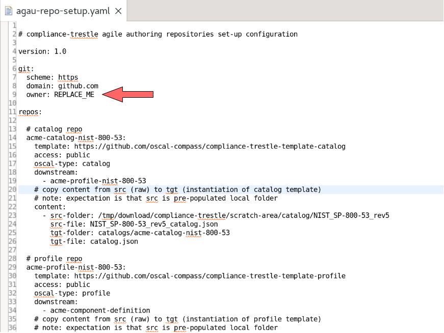

#  Compliance-trestle agile-authoring

This repo is comprises documentation and tutorial for OSCAL-oriented agile authoring pipelines.
To establish foundational knowledge about OSCAL and the agile authoring paradigm, see the references at the bottom of this page.

You can jump directly to step 5 to setup repos, if you have the pre-reqs installed already (steps 3 and 4).


##### 1.0 Overview: agile authoring for compliance-trestle

Compliance-[trestle](https://github.com/oscal-compass/compliance-trestle)
supports agile authoring of 
[OSCAL](https://pages.nist.gov/OSCAL/) 
artifacts such as 
[catalogs](https://pages.nist.gov/OSCAL-Reference/models/latest/catalog/json-outline/), 
[profiles](https://pages.nist.gov/OSCAL-Reference/models/latest/profile/json-outline/),
and
[component-definitions](https://pages.nist.gov/OSCAL-Reference/models/latest/component-definition/json-outline/)
which can be managed in a GIT repo with all the associated built-in desirable features including release management, semantic versioning, access control etc.

Beneficially, markdown snippets (or spread sheet csv's) are automatically supported which facilitates management of large OSCAL documents in more manageable pieces that are understandable by compliance-oriented personnel. Distribution of modified OSCAL artifacts to dependent repos is configurable.

Shown below are repos that can be easily setup using the templates and setup scripting availing from the present repo. 

The `catalog` repo maintains a catalog. The catalog is represented in machine readable format (OSCAL json) and is maintained automatically behind-the-scenes by trestle. Users modify portions of the catalog by updating the markdown (text). Markdown updates are collected into a release, which triggers posting the updated OSCAL catalog to the downstream profile repo.

The `profile` repo maintains a profile, a selection of controls from the catalog. The profile is represented in machine readable format (OSCAL json) and is maintained automatically behind-the-scenes by trestle. Users modify portions of the profile by updating the markdown (text). Markdown updates are collected into a release, which triggers posting the updated OSCAL profile to the downstream component-definition repo.

The `component-definition` repo maintains a component-definition, the connection of controls from the profile to policies that perform checks. The component-definition is represented in machine readable format (OSCAL json) and is maintained automatically behind-the-scenes by trestle. Users modify portions of the component-definition by updating the spread sheet (csv). Spread sheet updates are collected into a release, which triggers posting the updated OSCAL component-definition to the downstream system-security-plan repo.


-----


-----


##### 2.0 GIT repo templates

A collection of agile authoring templates are provided, each pre-populated with the scripts and
configurations needed to support agile authoring.

Create repo(s) to support the artifact(s) you desire by instantiating each from the template type desired and performing some minimal customization.

Templates are provided to set up agile authoring for each of the following: catalog, profile and component-definition.

###### template links

The following are template GIT repos that can be used to create corresponding trestle-based agile authoring repos by performing a few needed modifications to suit your environment.

- [catalog](https://github.com/oscal-compass/compliance-trestle-template-catalog)
- [profile](https://github.com/oscal-compass/compliance-trestle-template-profile)
- [component-definition](https://github.com/oscal-compass/compliance-trestle-template-component-definition)


<a name="anchor3dot0">
</a>

##### 3.0 GIT pre-requisites

In order to establish a collection of repos, one each for `catalog`, `profile` and `component-definition`, these are the pre-requisites needed in the GIT domain. 

Instructions are given on setting up GitHub artifacts, if you don't already have them:

- Setup a GitHub account: [signing-up-for-a-new-github-account](https://docs.github.com/en/get-started/signing-up-for-github/signing-up-for-a-new-github-account)
- Create a GitHub token: [creating-a-personal-access-token](https://docs.github.com/en/enterprise-server@3.6/authentication/keeping-your-account-and-data-secure/managing-your-personal-access-tokens#creating-a-personal-access-token)

Suggested GitHub token privileges:
<i>
admin:enterprise, admin:gpg_key, admin:org, admin:org_hook, admin:public_key, admin:repo_hook, admin:ssh_signing_key, codespace, delete:packages, delete_repo`*`, gist, notifications, project, repo, user, workflow`*`, write:discussion, write:packages

`*` indicates required token privilege for scripting assisted repo setup/teardown, described below.
</i>

<a name="anchor4dot0">
</a>

##### 4.0 Local pre-requisites for automated repo's setup

This repo contains scripting that assists in the setup of your agile authoring repos. For the scripting to run successfully, the following pre-requisites are needed on your local machine (e.g. laptop):

- Python (3.9 or greater): [install Python](https://wiki.python.org/moin/BeginnersGuide/Download)
- make, or [gmake](https://formulae.brew.sh/formula/make) for Mac
- git command: [git install](https://github.com/git-guides/install-git)
- gh command: [gh installation](https://github.com/cli/cli#installation)

##### 5.0 Assisted repos setup, with sample data content

Assure pre-requisites [3.0](#anchor3dot0) and [4.0](#anchor4dot0) have been met.

Once the pre-requisites are installed, use the scripting from located in this repo to setup catalog, profile and component-definition repos. The script employs the templates cited above to create catalog, profile, and component-definition and customized for the example Acme organization.

For the catalog and profile, the scripting downloads and employs the OSCAL json from NIST 800-53.

For the component-definition, the scripting download and employs a mini-csv file from the present repo.

Steps to create the repos follow.

###### 5.1 download this repo


```
$ mkdir git.clone   
$ cd git.clone  
git.clone$  git clone https://github.com/oscal-compass/compliance-trestle-agile-authoring.git
Cloning into 'compliance-trestle-agile-authoring'...
remote: Enumerating objects: 224, done.
remote: Counting objects: 100% (224/224), done.
remote: Compressing objects: 100% (208/208), done.
remote: Total 224 (delta 86), reused 141 (delta 7), pack-reused 0
Receiving objects: 100% (224/224), 15.76 MiB | 55.26 MiB/s, done.
Resolving deltas: 100% (86/86), done.
```

###### 5.2 export your GH_TOKEN (replace with your token value)

```
$ export GH_TOKEN=<ABCDEFGHIJKLMNOPQRSTUVWXYZ1234567890>
```

###### 5.3 modify the scripting config file with the correct repo <i style="color:red">owner</i>

```
$ cd compliance-trestle-agile-authoring

- use the editor or your choice to edit agau-repo-setup.yaml
- locate the string REPLACE_ME and replace with the correct repo "owner" value
- save the changed file
```

modify config file visuals:

<details>
<summary>before</summary>

</details>

<details>
<summary>after</summary>

</details>

###### 5.4 run the scripting to `create` the repos

The scripting comprises two basic parts. Part I is to fetch sample content data from public repos:

- NIST_SP-800-53_rev5_catalog.json
- NIST_SP-800-53_rev5_HIGH-baseline_profile.json
- acme-component-definition.csv (and acme-component-definition.config)

Part II is to create the agile authoring repos, customize the scripting contained therein, and install the content acquired in part I.

Issue the `make create` command to perform fetching and creating. See console example below.

<small>
Note: use gmake on Mac.
</small>


```
make create
if [ ! -d "/tmp/download/compliance-trestle/scratch-area/catalog/NIST_SP-800-53_rev5" ]; then \
	mkdir -p /tmp/download/compliance-trestle/scratch-area/catalog/NIST_SP-800-53_rev5; \
	cd /tmp/download/compliance-trestle/scratch-area/catalog/NIST_SP-800-53_rev5; \
	wget https://raw.githubusercontent.com/usnistgov/oscal-content/release-v1.0.5-update/nist.gov/SP800-53/rev5/json/NIST_SP-800-53_rev5_catalog.json; \
fi \

--2023-11-13 15:34:52--  https://raw.githubusercontent.com/usnistgov/oscal-content/release-v1.0.5-update/nist.gov/SP800-53/rev5/json/NIST_SP-800-53_rev5_catalog.json
Resolving raw.githubusercontent.com (raw.githubusercontent.com)... 185.199.110.133, 185.199.111.133, 185.199.108.133, ...
Connecting to raw.githubusercontent.com (raw.githubusercontent.com)|185.199.110.133|:443... connected.
HTTP request sent, awaiting response... 200 OK
Length: 9068764 (8.6M) [text/plain]
Saving to: ‘NIST_SP-800-53_rev5_catalog.json’

NIST_SP-800-53_rev5_catalog.json                100%[======================================================================================================>]   8.65M  35.0MB/s    in 0.2s    

2023-11-13 15:34:52 (35.0 MB/s) - ‘NIST_SP-800-53_rev5_catalog.json’ saved [9068764/9068764]

if [ ! -d "/tmp/download/compliance-trestle/scratch-area/profile/NIST_SP-800-53_rev5" ]; then \
	mkdir -p /tmp/download/compliance-trestle/scratch-area/profile/NIST_SP-800-53_rev5; \
	cd /tmp/download/compliance-trestle/scratch-area/profile/NIST_SP-800-53_rev5; \
	wget https://raw.githubusercontent.com/usnistgov/oscal-content/release-v1.0.5-update/nist.gov/SP800-53/rev5/json/NIST_SP-800-53_rev5_HIGH-baseline_profile.json; \
fi \

--2023-11-13 15:34:52--  https://raw.githubusercontent.com/usnistgov/oscal-content/release-v1.0.5-update/nist.gov/SP800-53/rev5/json/NIST_SP-800-53_rev5_HIGH-baseline_profile.json
Resolving raw.githubusercontent.com (raw.githubusercontent.com)... 185.199.111.133, 185.199.108.133, 185.199.109.133, ...
Connecting to raw.githubusercontent.com (raw.githubusercontent.com)|185.199.111.133|:443... connected.
HTTP request sent, awaiting response... 200 OK
Length: 10379 (10K) [text/plain]
Saving to: ‘NIST_SP-800-53_rev5_HIGH-baseline_profile.json’

NIST_SP-800-53_rev5_HIGH-baseline_profile.json  100%[======================================================================================================>]  10.14K  --.-KB/s    in 0s      

2023-11-13 15:34:53 (35.4 MB/s) - ‘NIST_SP-800-53_rev5_HIGH-baseline_profile.json’ saved [10379/10379]

if [ ! -d "/tmp/download/compliance-trestle/scratch-area/component-definition/data" ]; then \
	mkdir -p /tmp/download/compliance-trestle/scratch-area/component-definition/data; \
	cd $(DIR_COM); \
	wget https://raw.githubusercontent.com/oscal-compass/compliance-trestle-agile-authoring/main/data/acme-component-definition.csv; \
	wget https://raw.githubusercontent.com/oscal-compass/compliance-trestle-agile-authoring/main/data/acme-component-definition.config; \
fi \

/bin/sh: line 2: DIR_COM: command not found
--2023-11-13 15:34:53--  https://raw.githubusercontent.com/oscal-compass/compliance-trestle-agile-authoring/main/data/acme-component-definition.csv
Resolving raw.githubusercontent.com (raw.githubusercontent.com)... 185.199.108.133, 185.199.109.133, 185.199.110.133, ...
Connecting to raw.githubusercontent.com (raw.githubusercontent.com)|185.199.108.133|:443... connected.
HTTP request sent, awaiting response... 200 OK
Length: 22716 (22K) [text/plain]
Saving to: ‘acme-component-definition.csv.7’

acme-component-definition.csv.7                 100%[======================================================================================================>]  22.18K  --.-KB/s    in 0.005s  

2023-11-13 15:34:53 (4.20 MB/s) - ‘acme-component-definition.csv.7’ saved [22716/22716]

--2023-11-13 15:34:53--  https://raw.githubusercontent.com/oscal-compass/compliance-trestle-agile-authoring/main/data/acme-component-definition.config
Resolving raw.githubusercontent.com (raw.githubusercontent.com)... 185.199.109.133, 185.199.110.133, 185.199.111.133, ...
Connecting to raw.githubusercontent.com (raw.githubusercontent.com)|185.199.109.133|:443... connected.
HTTP request sent, awaiting response... 200 OK
Length: 234 [text/plain]
Saving to: ‘acme-component-definition.config.7’

acme-component-definition.config.7              100%[======================================================================================================>]     234  --.-KB/s    in 0s      

2023-11-13 15:34:53 (4.60 MB/s) - ‘acme-component-definition.config.7’ saved [234/234]

python python/agau_repo_setup.py --action create --config agau-repo-setup.yaml
13-Nov-23 15:35:01 I repo https://github.com/degenaro/acme-catalog-nist-800-53 created
13-Nov-23 15:35:08 I repo https://github.com/degenaro/acme-profile-nist-800-53 created
13-Nov-23 15:35:16 I repo https://github.com/degenaro/acme-component-definition created

```

That's it. You should now be able to visit the URLs of the newly minted repos. Look in the `develop` branch to see the `data` and corresponding OSCAL documents under catalogs, profiles, and component-definitions accordingly.
 

##### 6.0 Assisted repos teardown

If/when the repos are no longner wanted, the repos can be easily removed. 
<i style="color:red">
HOWEVER, BE CAREFUL AS DELETION CANNOT BE UNDONE.
</i>


###### 6.1 run the scripting to `delete` the repos

Issue the `make delete` command to perform delete. See console example below.

<small>
Note: use gmake on Mac.
</small>

```
make delete
python python/agau_repo_setup.py --action delete --config agau-repo-setup.yaml
13-Nov-23 15:43:34 I repo https://github.com/degenaro/acme-catalog-nist-800-53 deleted
13-Nov-23 15:43:34 I repo https://github.com/degenaro/acme-profile-nist-800-53 deleted
13-Nov-23 15:43:34 I repo https://github.com/degenaro/acme-component-definition deleted
```

##### 7.0 references

- [Compliance Automated Standard Solution (COMPASS), Part 1: Personas and Roles](https://dzone.com/articles/compass-compliance-part-1)
- [Compliance Automated Standard Solution (COMPASS), Part 2: Trestle SDK](https://dzone.com/articles/compliance-automated-standard-solution-compass-part-2-trestle-sdk)
- [Compliance Automated Standard Solution (COMPASS), Part 3: Artifacts and Personas](https://dzone.com/articles/compliance-automated-standard-solution-compass-part-3-artifacts-and-personas)
- [Compliance Automated Standard Solution (COMPASS), Part 4: Topologies of Compliance Policy Administration Centers](https://dzone.com/articles/compliance-automated-standard-solution-compass-part4-topologies-compliance-policy-administration-centers)


- [Trestle: Compliance-as-Code Orchestrator and Automation Workflows](https://csrc.nist.gov/csrc/media/Presentations/2022/oscal-mini-workshop-2-ibm-s-trestle/IBM_Trestle.pdf)


- [NIST OSCAL](https://pages.nist.gov/OSCAL/)

## License & Authors

If you would like to see the detailed LICENSE click [here](LICENSE).
Consult [contributors](https://github.com/oscal-compass/compliance-trestle/graphs/contributors) for a list of authors and [maintainers](https://github.com/oscal-compass/community/blob/main/MAINTAINERS.md) for the core team.

```text
# Copyright (c) 2024 The OSCAL Compass Authors. All rights reserved.
#
# Licensed under the Apache License, Version 2.0 (the "License");
# you may not use this file except in compliance with the License.
# You may obtain a copy of the License at
#
#     https://www.apache.org/licenses/LICENSE-2.0
#
# Unless required by applicable law or agreed to in writing, software
# distributed under the License is distributed on an "AS IS" BASIS,
# WITHOUT WARRANTIES OR CONDITIONS OF ANY KIND, either express or implied.
# See the License for the specific language governing permissions and
# limitations under the License.

```

______________________________________________________________________

We are a Cloud Native Computing Foundation sandbox project.

The Linux Foundation® (TLF) has registered trademarks and uses trademarks. For a list of TLF trademarks, see [Trademark Usage](https://www.linuxfoundation.org/legal/trademark-usage)".

*Agile Authoring was originally created by IBM.*
